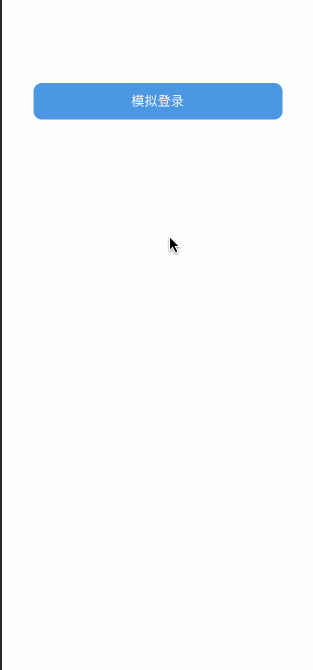

# Vue学习，上手demo记录(vue-cli3、vue-router、vuex、axios、sass、vant等、待续）
---

### 功能演示
---



### 安装
```
npm install
```

### 编译运行
```
npm run dev

```

### 打包
```
npm run build

```

#### 注：本项目数据基本来自于 百思不得姐 ，此数据仅用于学习使用，不可用于商业目的，否则后果自负。